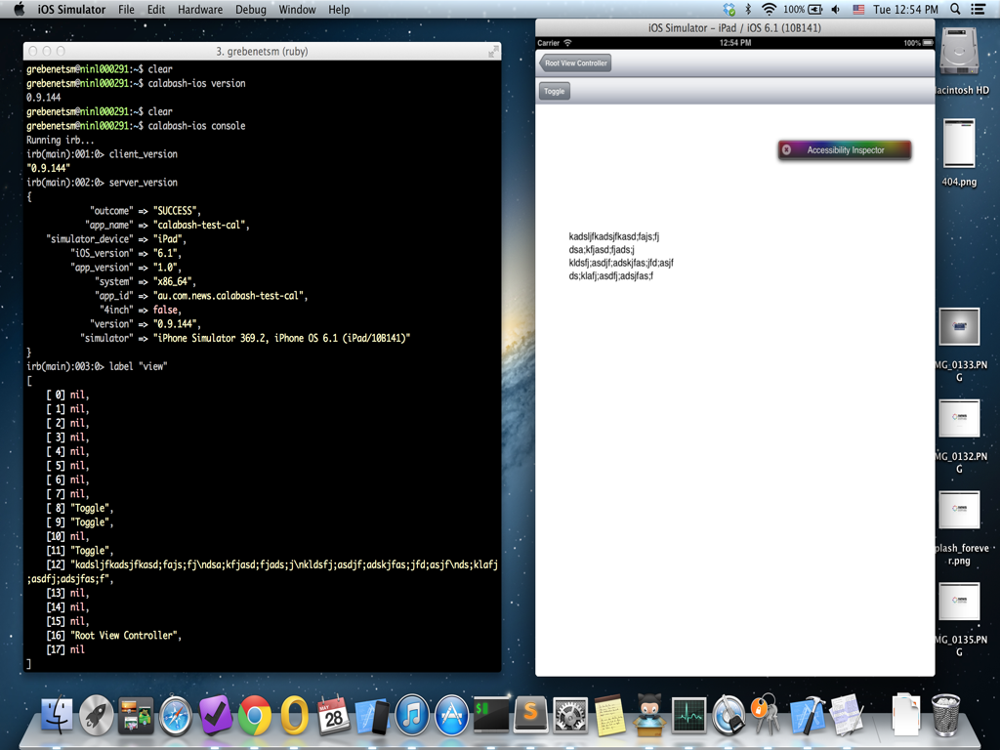
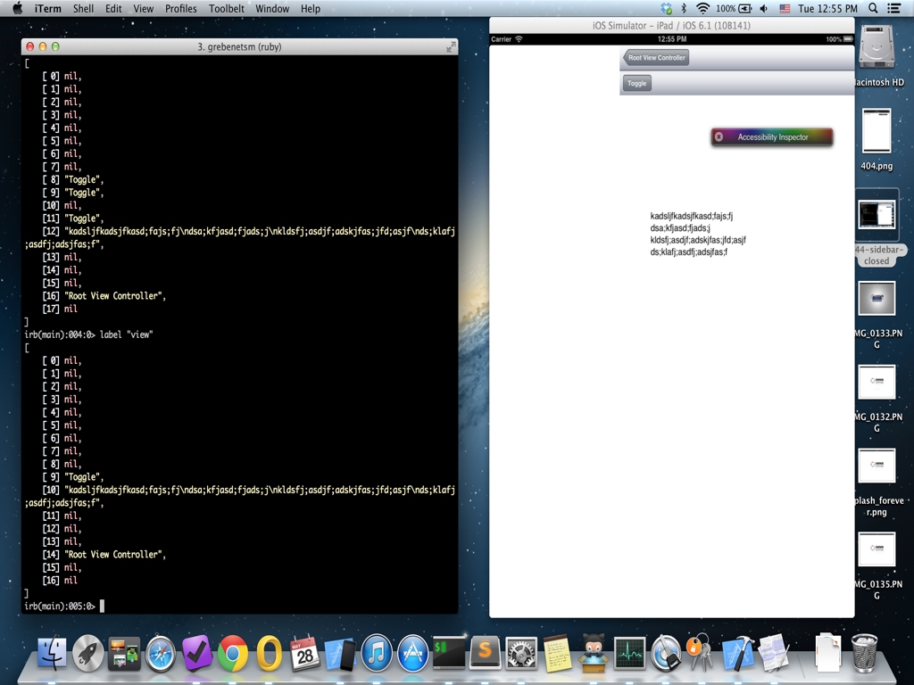
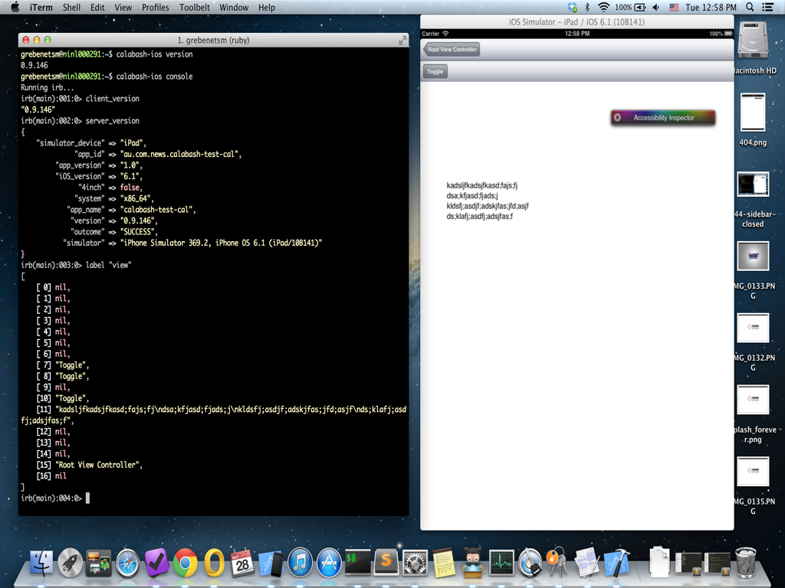
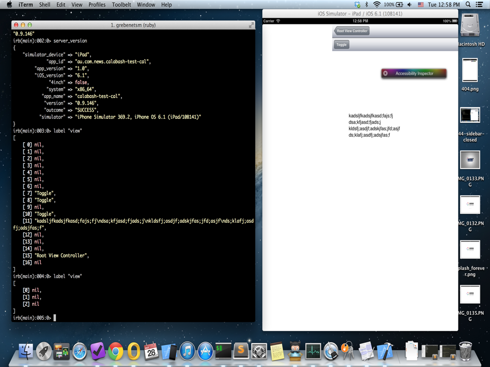

calabash-test
=============

Test app to demonstrate calabash iOS bug(s)

Project uses CocoaPods so start with `pod install` after cloning.

To add Calabash test target I used `calabash-ios setup` command.

# Visibility Bug
Visibility is broken in 0.9.146, visible and touchable elements are not returned by the query.
The same app visibility is OK with 0.9.144

## 0.9.144
Slider closed, all visible.

Slider opened, all visible.

## 0.9.146
Slider closed, all visible.

Slider opened, **visibility broken**.
